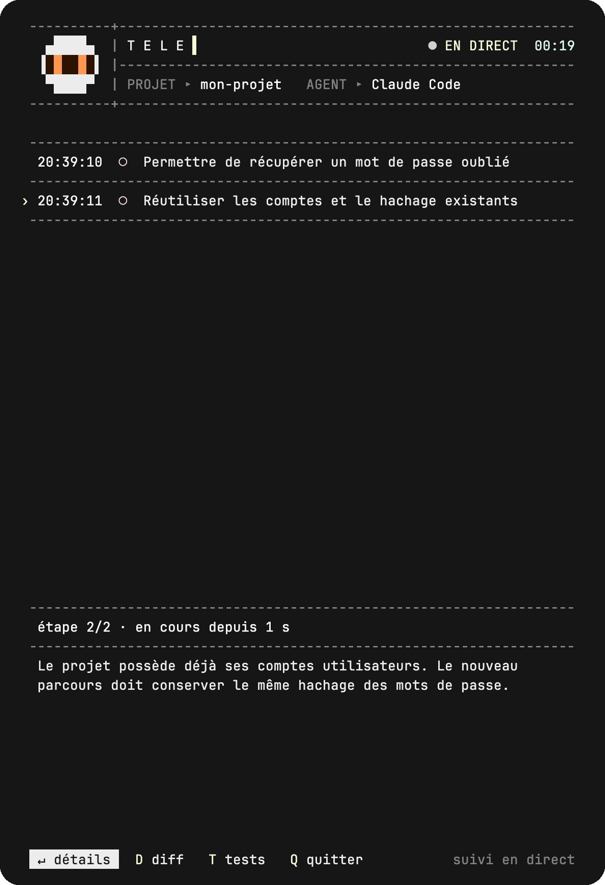

<p align="center">
  
</p>

<h1 align="center">Votre agent code. Vous gardez le fil.</h1>

<p align="center">
  Le second terminal qui rend le travail de <strong>Claude Code</strong> et <strong>Codex</strong> lisible.<br>
  Une timeline en direct, les changements à portée de main, vos sessions à retrouver.
</p>

<p align="center">
  <a href="#démarrer">Démarrer</a> &nbsp;·&nbsp;
  <a href="#voir-telex-en-action">Voir la démo</a> &nbsp;·&nbsp;
  <a href="docs/guide.md">Documentation</a>
</p>

<p align="center">
  <a href="https://github.com/hooop/telex/actions/workflows/tests.yml"></a>
  <a href="LICENSE"></a>
  
</p>

## Voir Telex en action

L’agent travaille dans sa fenêtre habituelle. À côté, Telex raconte l’avancement :
ce qui commence, ce qui aboutit, ce qui échoue et ce qui est corrigé.

<p align="center">
  
</p>

<p align="center">
  <sub>Vraie interface Telex, scénario de démonstration accéléré avec des données fictives.</sub><br>
  <sub><a href="docs/demo/timeline.png">Voir une capture fixe</a></sub>
</p>

## Du premier changement au dernier test

### Gardez le fil

Une ligne par étape. Les erreurs et les corrections restent visibles ; vous pouvez
remonter la timeline pendant que l’agent poursuit son travail.

### Explorez les changements

Sélectionnez une étape pour ouvrir son récit, ses fichiers et son diff.
Les différences de code viennent d’instantanés pris par Telex.
Avec Claude Code, retrouvez aussi les commandes et les résultats de tests observés.

### Retrouvez vos sessions

Rouvrez une session pour reprendre le suivi ou relire son bilan.
La timeline reste consultable après la fermeture de l’agent.

## Démarrer

**Prérequis :** macOS ou Linux, Node.js **22+**, git **2.31+** et Claude Code ou Codex CLI
installé et connecté à votre compte. Sous Windows, utilisez WSL.

```bash
npm install -g github:hooop/telex
cd mon-projet
telex claude
```

Vous utilisez Codex ? Lancez `telex codex`.

Telex ouvre l’agent dans une seconde fenêtre ou un panneau tmux.
Donnez-lui une tâche comme d’habitude : les étapes apparaissent dans le terminal d’origine.

**Aucune clé API supplémentaire. Aucune dépendance npm.**
Telex utilise votre agent et votre abonnement habituels.

[Autres installations et mise à jour](docs/guide.md#installation) ·
[Choisir son terminal](docs/guide.md#terminaux-pris-en-charge)

## Quelques touches suffisent

| Touche | À quoi elle sert |
|---|---|
| `↑` `↓` | Parcourir les étapes. |
| `Entrée` | Ouvrir les détails de l’étape sélectionnée. |
| `D` | Explorer son diff. |
| `T` | Consulter les vérifications. |
| `Espace` | Reprendre le suivi en direct depuis la timeline. |
| `Q` | Quitter la timeline ; l’agent continue. |

```bash
telex sessions       # retrouver ses sessions
telex replay last    # rouvrir la dernière, même si elle tourne encore
```

[Voir toutes les commandes](docs/guide.md#commandes) ·
[Tous les raccourcis](docs/guide.md#raccourcis-clavier)

## Dans les coulisses

L’agent décrit les étapes via un outil local. Telex les affiche, prend des instantanés
pour les diffs et enregistre la session dans `~/.telex`.
Les options sont passées au lancement : les fichiers de configuration de l’agent
et le dépôt du projet restent inchangés.

| Fonction | Claude Code | Codex |
|---|:---:|:---:|
| Timeline en direct et relecture | ✓ | ✓ |
| Fichiers et diffs par étape | ✓ | ✓ |
| Vérifications déclarées par l’agent | ✓ | ✓ |
| Commandes et résultats de tests observés | ✓ | — |

Telex n’émet aucune requête réseau. Le récit fait toutefois partie de la conversation
de l’agent avec son fournisseur. Les fichiers sensibles sont exclus des instantanés ;
le masquage des secrets reste une protection heuristique.

[Comprendre le fonctionnement](docs/guide.md#fonctionnement) ·
[Données et confidentialité](docs/guide.md#données-et-confidentialité) ·
[Limites connues](docs/guide.md#limites-connues)

## Pour aller plus loin

- **[Guide complet](docs/guide.md)** — installation, commandes et réglages.
- **[Dépannage](docs/guide.md#dépannage)** — terminal, connexion de l’agent et affichage.
- **[Personnaliser les consignes](docs/guide.md#personnaliser-les-consignes-de-lagent)** — adapter les titres et le découpage des étapes.
- **[Historique des versions](CHANGELOG.md)** — suivre les changements.

## Contribuer

Un problème, une idée ou un retour sur votre terminal ?
[Ouvrez une issue](https://github.com/hooop/telex/issues) ou proposez une pull request.
Les échanges et la documentation sont en français.

```bash
git clone https://github.com/hooop/telex.git
cd telex
npm test
```

[Guide de développement](docs/guide.md#développement) ·
[Créer les démos VHS](docs/demo/README.md)

---

<p align="center">Un outil ouvert, sous <a href="LICENSE">licence MIT</a>.</p>
